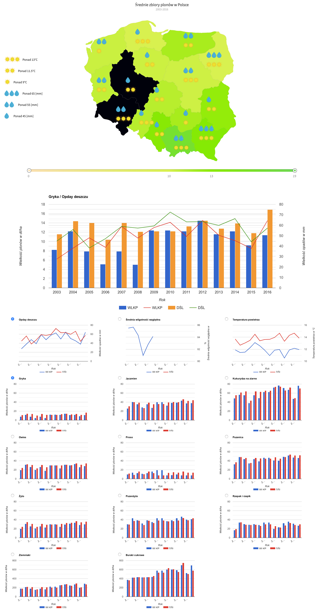

# Advanced Charts - Information Graphics [](https://circleci.com/gh/Szalbik/projektGI)

> This application was created for purpose of egzamination on university.

## Table of contents

- [General info](#general-info)
- [Screenshots](#screenshots)
- [Technologies](#technologies)
- [Setup](#setup)
- [Features](#features)
- [Status](#status)
- [Inspiration](#inspiration)
- [Contact](#contact)
- [Acknowledge](#acknowledge)

## Screenshots



## General info

It allow to compare how much yields was harvested in reference to previous years and visualize meteo and yields charts on map.

## Technologies

- Javascript ES6 / ES7
- react - 
- react-fusioncharts - 
- react-google-charts - 
- csv - 
- d3 - 
- lodash - 

## Setup

```
git clone git@github.com:Szalbik/projektGI.git
cd projektGI
npm install / yarn install
npm start / yarn start
```

## Features

List of features ready and TODOs for future development

- Show geo map depends on real yields data
- Display each yield in separate chart
- Display combined data in one big chart
- Add icons to map depends on how much railfall and temperature was in previous years

## Status

Project is: _finished_.

## Inspiration

Project inspired by [@Jerzy Stefanowski](http://www.cs.put.poznan.pl/jstefanowski/), based on [@FusionCharts](https://www.fusioncharts.com) and [@GoogleCharts](https://developers.google.com/chart/)

## Contact

Created by [@Damian Szalbierz](https://github.com/Szalbik) and [@Wojciech Bełka](https://github.com/wbelka94) - feel free to contact us!

## Acknowledge

- [Yields data source](https://gis.gov.pl)
- [Meteo data source](https://dane.imgw.pl/)
